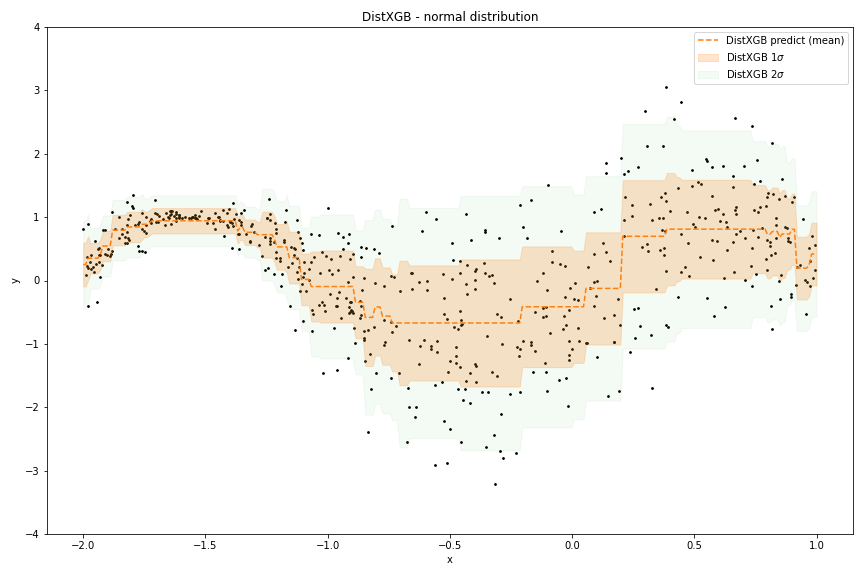

============
dist_xgboost
============

XGBoost for probabilistic prediction. Just like normal xgboost, but we estimate
all parameters of the distribution (as opposed to e.g. just regressing to the
mean). This enables a simple way to estimate uncertainty:

Usage
===========

DistXGBoost follows the scikit-learn xgboost API, except for an additional
keyword in the constructor for specifying the distribution. Given some data,
we can fit a model:

.. code-block:: python

      from dist_xgboost import DistXGboost
      from dist_xgboost.distributions import Normal

      model = DistXGBoost(
          distribution=Normal(),
          max_depth=2,
          n_estimators=500
      )
      model.fit(
          X_train, y_train,
          eval_set=[(X_test, y_test)],
          early_stopping_rounds=10
      )

After fitting, we can predict the parameters of the distribution for new data:

.. code-block:: python

      mean, var = model.predict_dist(X_test)

.. _pyscaffold-notes:

Note
====

This project has been set up using PyScaffold 4.0.1. For details and usage
information on PyScaffold see https://pyscaffold.org/.
