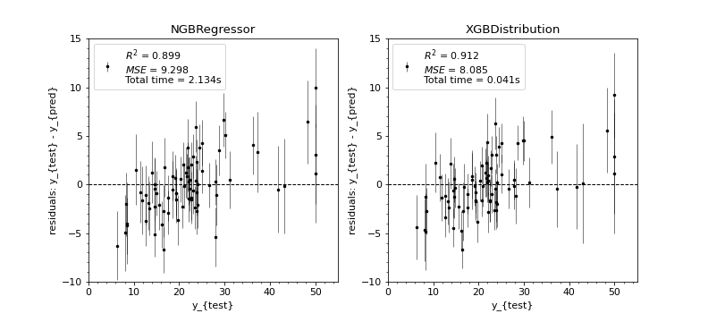

.. image:: https://github.com/CDonnerer/xgb-dist/workflows/test.yml/badge.svg?branch=main
  :target: https://github.com/CDonnerer/xgb-dist/actions/workflows/test.yml

.. image:: https://coveralls.io/repos/github/CDonnerer/xgb-dist/badge.svg?branch=main
  :target: https://coveralls.io/github/CDonnerer/xgb-dist?branch=main

============
xgb-dist
============

XGBoost for probabilistic prediction. Like `NGBoost`_, but faster.

.. image:: imgs/xgb_dist.png
    :align: center
    :width: 600px
    :alt: XGBDistribution example

Usage
===========

XGBDistribution follows the scikit-learn xgboost API, except for an additional
keyword in the constructor for specifying the distribution. Given some data,
we can fit a model:

.. code-block:: python

      from xgb_dist import XGBDistribution

      model = XGBDistribution(
          distribution="normal",
          max_depth=2,
          n_estimators=500
      )
      model.fit(
          X_train, y_train,
          eval_set=[(X_test, y_test)],
          early_stopping_rounds=10
      )

After fitting, we can predict the parameters of the distribution for new data:

.. code-block:: python

      mean, var = model.predict_dist(X_test)

Performance comparison
========================

XGBDistribution follows the method shown in the `NGBoost`_ library, using
natural gradients to estimate the parameters of the distribution.

Below, we show a performance comparison between the NGBRegressor and
XGBDistribution models, using the Boston Housing dataset and a normal
distribution. We note that while the performance of the two models is basically
identical, XGBDistribution is **50x faster** (both fit and predict steps).

.. _pyscaffold-notes:

Note
====

This project has been set up using PyScaffold 4.0.1. For details and usage
information on PyScaffold see https://pyscaffold.org/.

.. _ngboost: https://github.com/stanfordmlgroup/ngboost
